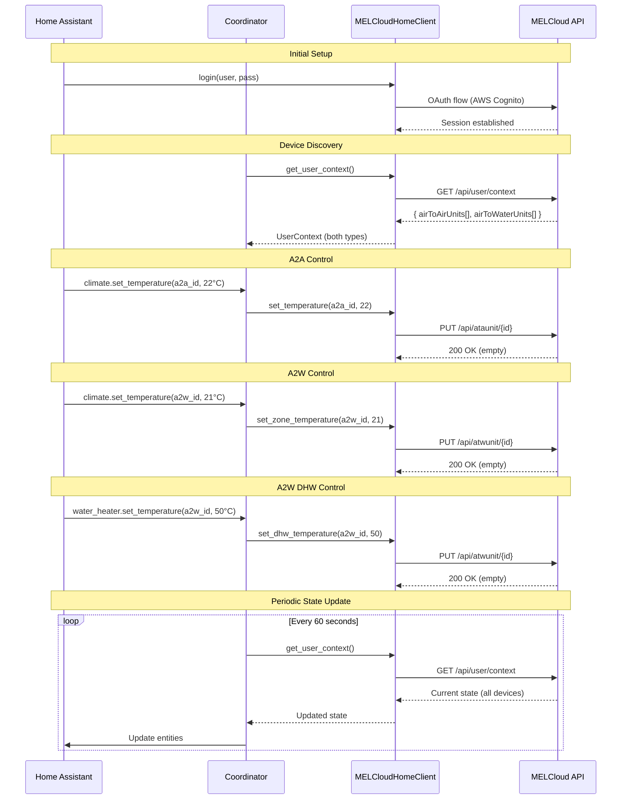
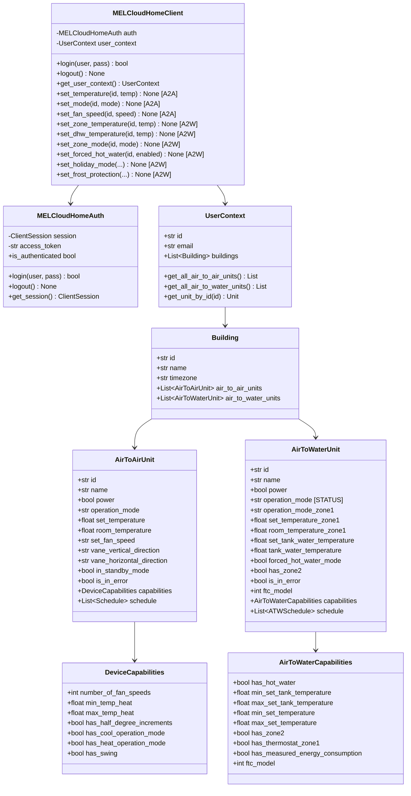
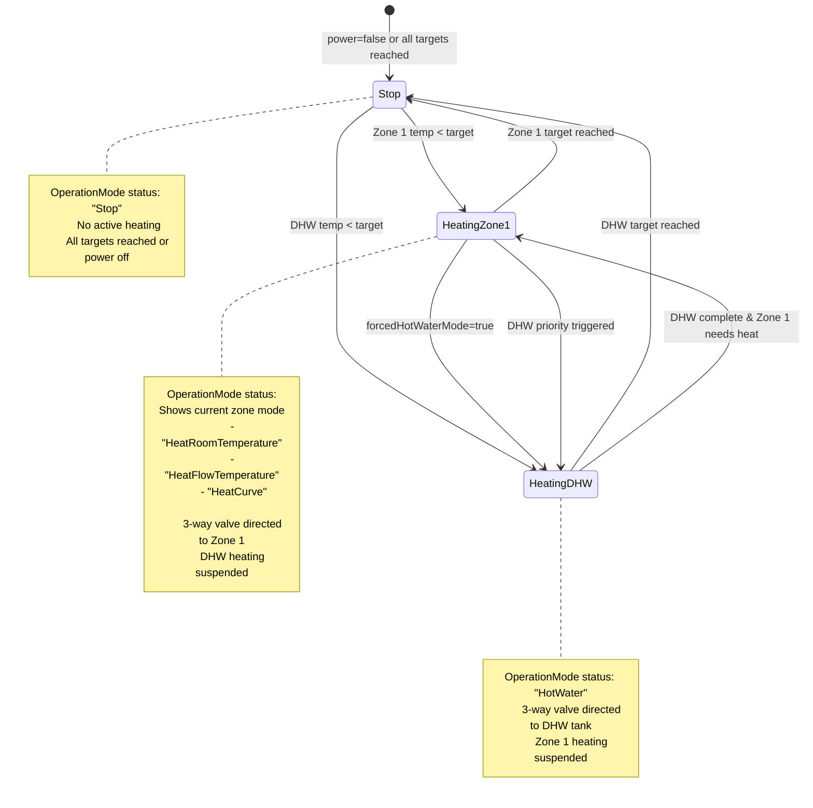
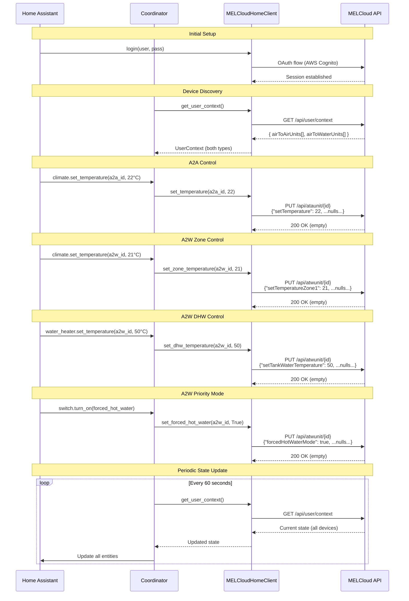
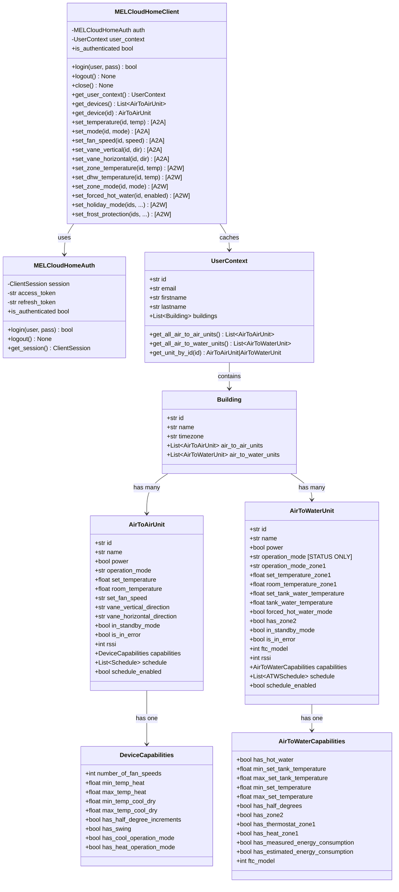
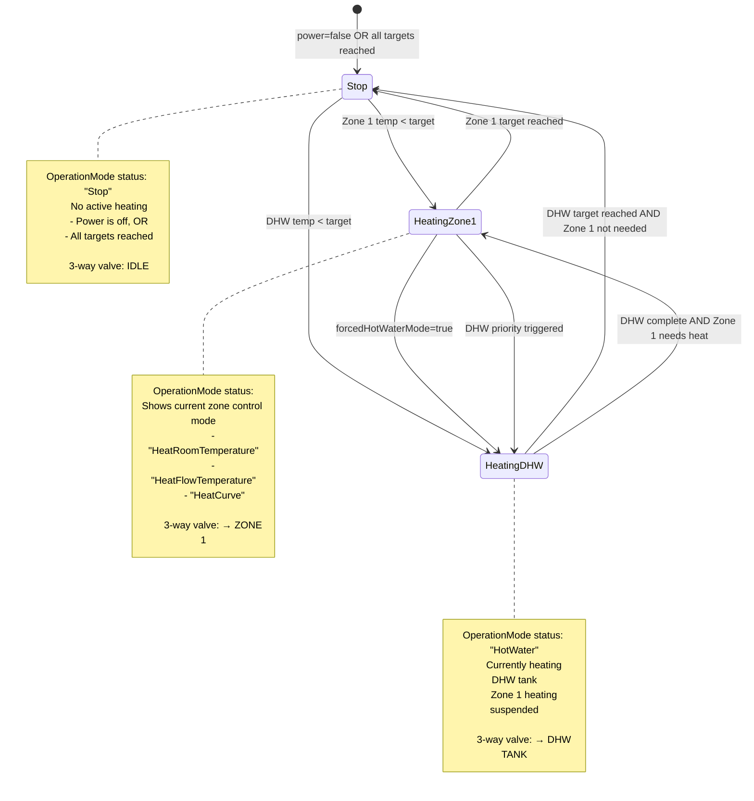

# MELCloud Home Integration - Architecture Overview

Visual architecture documentation for the MELCloud Home custom integration for Home Assistant.

**Last Updated:** 2026-01-03
**Related:** [ADR-011: Multi-Device-Type Architecture](decisions/011-multi-device-type-architecture.md)

---

## Key Architectural Principles

1. **Single Unified Client** - One `MELCloudHomeClient` handles both Air-to-Air and Air-to-Water devices
2. **Shared Authentication** - AWS Cognito OAuth session shared across all device types
3. **Multi-Type Container** - `UserContext` holds both device types in parallel arrays
4. **Device-Specific Methods** - Method names indicate which device type they control
5. **3-Way Valve Awareness** - A2W architecture reflects physical hardware limitation

---

## 1. System Overview

High-level component architecture showing how Home Assistant entities connect to the MELCloud API through the integration layers.

```mermaid
graph TB
    subgraph "Home Assistant"
        Climate[Climate Entity<br/>A2A Units]
        WaterHeater[Water Heater Entity<br/>A2W DHW]
        Sensors[Sensor Entities<br/>Temps, Status, Energy]
    end

    subgraph "MELCloud Home Integration"
        Coordinator[Update Coordinator<br/>Polling & State Management]

        subgraph "API Client Layer"
            Client[MELCloudHomeClient<br/>Single Unified Client]
            Auth[Authentication<br/>AWS Cognito OAuth]
        end

        subgraph "Models Layer"
            A2AModel[AirToAirUnit<br/>Model]
            A2WModel[AirToWaterUnit<br/>Model]
            Context[UserContext<br/>Multi-Type Container]
        end
    end

    subgraph "MELCloud API"
        UserContextAPI[/api/user/context<br/>SHARED]
        A2AAPI[/api/ataunit/*<br/>A2A Control]
        A2WAPI[/api/atwunit/*<br/>A2W Control]
    end

    Climate --> Coordinator
    WaterHeater --> Coordinator
    Sensors --> Coordinator

    Coordinator --> Client
    Client --> Auth
    Client --> Context

    Context --> A2AModel
    Context --> A2WModel

    Client --> UserContextAPI
    Client --> A2AAPI
    Client --> A2WAPI

    Auth -.session.-> UserContextAPI
    Auth -.session.-> A2AAPI
    Auth -.session.-> A2WAPI
```

**Key Points:**

- **Single coordinator** manages polling for all device types
- **Single client** provides unified API interface
- **Shared auth** handles OAuth for all endpoints
- **UserContext** endpoint returns both device types in one response

---

## 2. Device Type Control Flow

Sequence diagram showing authentication, device discovery, and control operations for both device types.



**Key Points:**

- **Single login** serves all devices
- **UserContext returns both** device types in one call
- **Device type determines** which control endpoint used
- **Empty 200 responses** for all control commands
- **Periodic polling** updates state for all devices

---

## 3. Data Model Relationships

Class diagram showing how models are structured and related.



**Key Points:**

- **Single client class** with device-specific methods
- **Separate model classes** for each device type
- **Separate capability classes** (different fields)
- **UserContext** as multi-type container
- **Building** holds both unit type arrays

---

## 4. A2W 3-Way Valve Behavior

State diagram illustrating the Air-to-Water heat pump's 3-way valve operation and how it affects the `OperationMode` status field.



**Critical Understanding:**

1. **Physical Limitation:** Heat pump can only heat ONE thing at a time
   - 3-way valve directs hot water to either Zone 1 OR DHW tank
   - Cannot heat both simultaneously

2. **OperationMode is STATUS:**
   - Read-only field showing current valve position
   - Automatically determined by system
   - NOT a control parameter

3. **Control vs Status:**
   - **Control:** `operationModeZone1` = HOW to heat zone (user sets)
   - **Status:** `OperationMode` = WHAT is heating NOW (system reports)

4. **Forced Hot Water Mode:**
   - When enabled: DHW gets priority
   - Zone 1 suspended until DHW reaches target
   - Then automatically switches back to zone heating

5. **Summer Mode Workaround:**
   - Set Zone 1 target to minimum (10°C)
   - Room temp > target, so no zone heating
   - System only heats DHW as needed

---

## 5. HA Entity Responsibility Boundaries

**Reference:** [ADR-012: ATW Entity Architecture](decisions/012-atw-entity-architecture.md) for detailed power control architecture and implementation examples.

### Entity Responsibilities

**ATW (Air-to-Water) Heat Pump Entities:**

| Entity Type | Controls | Does NOT Control |
|-------------|----------|------------------|
| **switch** | • System power (ON/OFF)<br/>• Entire heat pump system | • Zone temperatures<br/>• DHW settings |
| **climate (zone)** | • Zone target temperature<br/>• Zone heating method (presets)<br/>• HVAC mode (HEAT/OFF delegates to power) | • Other zones<br/>• DHW tank settings |
| **water_heater** | • DHW tank temperature<br/>• DHW operation mode (eco/performance) | • **System power** (read-only)<br/>• Zone settings |

**Key Architectural Decisions:**

1. **Switch = Primary Power Control**
   - Single obvious control point for system power
   - Standard HA pattern for binary states

2. **Climate OFF = Power Delegation**
   - Climate OFF delegates to same power control method as switch
   - Maintains standard HA UX (users expect climate OFF to turn off heating)
   - No duplicate logic (Single Responsibility Principle)

3. **Water Heater = DHW Control Only**
   - No turn_on/turn_off methods (power state is read-only)
   - Focuses on DHW-specific settings
   - Clearer responsibility boundaries

**Rationale:**

- **Physical Reality:** Heat pump is ONE device with one power supply
- **Single Responsibility:** Each entity has one clear purpose
- **User Clarity:** Switch is obvious place for system power control
- **Standard HA UX:** Climate OFF works as expected (delegates to power control)

### 3-Way Valve Status Visibility

The 3-way valve position is exposed to users via:

1. **water_heater state attributes:**
   - `operation_status` - Current valve position ("HotWater", "HeatRoomTemperature", etc.)
   - `zone_heating_suspended` - Boolean (true when valve directed to DHW)

2. **Dedicated sensor:**
   - `sensor.{device_name}_operation_status` - Human-readable status
   - States: "idle", "heating_dhw", "heating_zone_1", "heating_zone_2"

3. **climate.hvac_action:**
   - Shows IDLE when valve is on DHW (even if zone temp below target)
   - Shows HEATING only when valve actually on this zone

**This visibility is critical for users to understand heat pump behavior.**

---

## 6. API Layer Structure

### File Organization

```
custom_components/melcloudhome/api/
├── __init__.py          # Package exports
├── auth.py              # AWS Cognito OAuth (shared)
├── exceptions.py        # Custom exceptions (shared)
├── client.py            # Facade pattern - composes ata/atw clients
├── client_ata.py        # ATA-specific control methods
├── client_atw.py        # ATW-specific control methods
├── const_shared.py      # Shared constants (User-Agent, endpoints)
├── const_ata.py         # ATA-specific constants (modes, fan speeds)
├── const_atw.py         # ATW-specific constants (zone modes, temp ranges)
├── models.py            # Shared models (Building, UserContext)
├── models_ata.py        # ATA-specific models (AirToAirUnit)
├── models_atw.py        # ATW-specific models (AirToWaterUnit)
└── parsing.py           # Shared parsing utilities
```

### Separation Strategy

**Facade pattern with composition:**

```python
# Main client provides unified interface
client = MELCloudHomeClient()

# ATA methods (via client.ata facade)
await client.ata.set_temperature(unit_id, temp)
await client.ata.set_mode(unit_id, mode)
await client.ata.set_fan_speed(unit_id, speed)

# ATW methods (via client.atw facade)
await client.atw.set_temperature_zone1(unit_id, temp)
await client.atw.set_dhw_temperature(unit_id, temp)
await client.atw.set_power(unit_id, power)
await client.atw.set_forced_hot_water(unit_id, enabled)
```

**Rationale:** Facade pattern provides single entry point while maintaining clean separation. See [ADR-011](decisions/011-multi-device-type-architecture.md) "Implementation Evolution" section for details.

---

## Home Assistant Entity Mapping

### Air-to-Air Units

**Entities created per A2A unit:**

- `climate.melcloudhome_{name}` - Main climate control
- `sensor.melcloudhome_{name}_room_temperature` - Current temp
- `sensor.melcloudhome_{name}_wifi_signal` - RSSI
- `sensor.melcloudhome_{name}_energy` - Energy consumption (if available)

### Air-to-Water Units

**Entities created per A2W unit:**

**Primary Control:**
- `switch.melcloudhome_{name}_system_power` - System power (ON/OFF)

**Climate & Water Heating:**
- `climate.melcloudhome_{name}_zone_1` - Zone 1 heating control
- `water_heater.melcloudhome_{name}_tank` - DHW tank control (no power control)

**Temperature Sensors:**
- `sensor.melcloudhome_{name}_zone_1_temperature` - Zone 1 room temp
- `sensor.melcloudhome_{name}_tank_temperature` - DHW tank temp

**Status Sensors:**
- `sensor.melcloudhome_{name}_operation_status` - 3-way valve position

**Binary Sensors:**
- `binary_sensor.melcloudhome_{name}_error` - Error state
- `binary_sensor.melcloudhome_{name}_connection` - Connection status
- `binary_sensor.melcloudhome_{name}_forced_dhw_active` - Forced DHW mode active

---

## 2. Device Type Control Flow

Sequence diagram showing complete flow from authentication through control operations.



---

## 3. Data Model Relationships

Class diagram showing the structure of models and their relationships.



---

## 4. A2W 3-Way Valve Behavior

State diagram showing how the Air-to-Water heat pump's 3-way valve determines what gets heated and how this affects the `OperationMode` status field.



### Physical System

```
Heat Pump → [3-Way Valve] → Zone 1 Heating
                    ↓
              DHW Tank Heating

Only ONE output active at a time
```

### Control Implications

**User sets:**

- `setTemperatureZone1`: 21°C (target)
- `setTankWaterTemperature`: 50°C (target)
- `forcedHotWaterMode`: false (no priority)
- `operationModeZone1`: "HeatRoomTemperature" (HOW to heat)

**System decides:**

- Current room temp: 19°C (< 21°C target) → needs heating
- Current DHW temp: 48°C (< 50°C target) → needs heating
- No forced mode → automatic balancing
- **OperationMode shows what's happening RIGHT NOW**

**Example sequence:**

1. System heats Zone 1 → `OperationMode: "HeatRoomTemperature"`
2. Zone reaches 21°C → switches to DHW
3. System heats DHW → `OperationMode: "HotWater"`
4. DHW reaches 50°C → switches back
5. Both at target → `OperationMode: "Stop"`

---

## Design Patterns

### 1. Sparse Update Pattern

Both device types use sparse updates:

```python
# Only change what you want to change
payload = {
    "power": None,              # No change
    "setTemperature": 22.0,     # Change this
    "operationMode": None,      # No change
    # ... all others: None
}
```

### 2. Capabilities-Driven Logic

```python
# Check capabilities before controlling
if unit.capabilities.has_zone2:
    # Zone 2 control
    await client.set_zone2_temperature(unit.id, 20.0)
```

### 3. Type-Safe Methods

```python
# A2A-specific methods won't work on A2W units
# A2W-specific methods won't work on A2A units
# No risk of cross-contamination
```

### 4. Multi-Device Discovery

```python
context = await client.get_user_context()

# Iterate all device types
for unit in context.get_all_air_to_air_units():
    # Setup A2A climate entity

for unit in context.get_all_air_to_water_units():
    # Setup A2W climate + water_heater entities
```

---

## Related Documentation

- **ADR-011:** [Multi-Device-Type Architecture](decisions/011-multi-device-type-architecture.md)
- **A2A API Reference:** [ata-api-reference.md](api/ata-api-reference.md)
- **A2W API Reference:** [atw-api-reference.md](api/atw-api-reference.md)
- **Device Comparison:** [device-type-comparison.md](api/device-type-comparison.md)
- **OpenAPI Spec:** [../openapi.yaml](../openapi.yaml)
