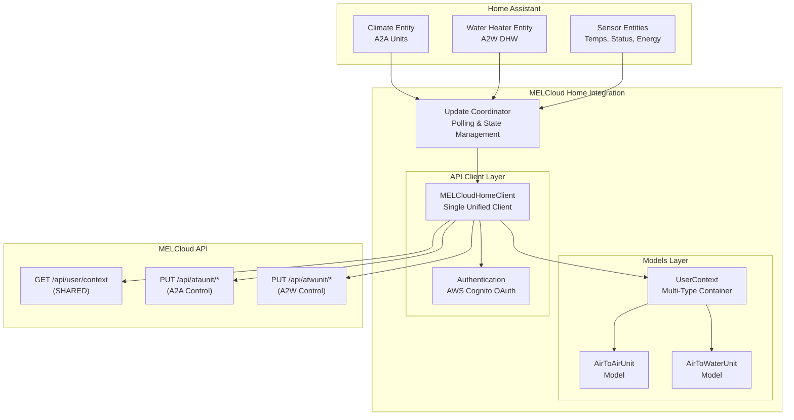
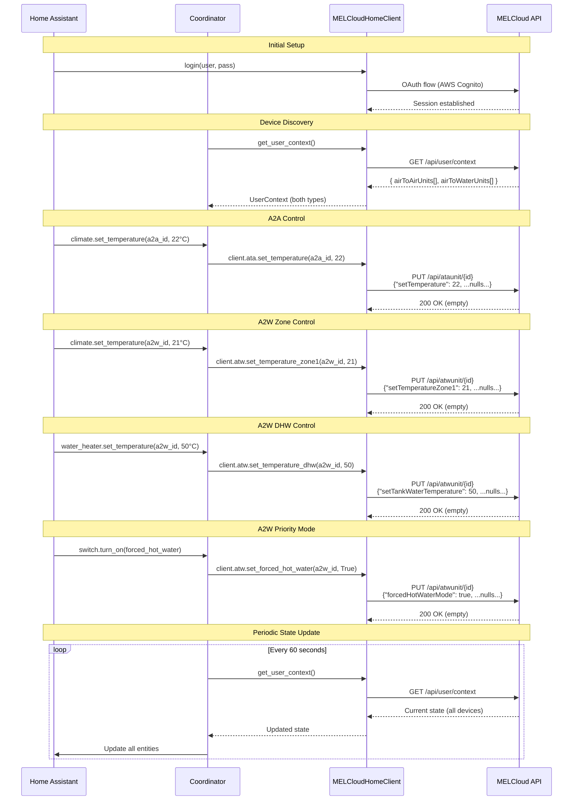
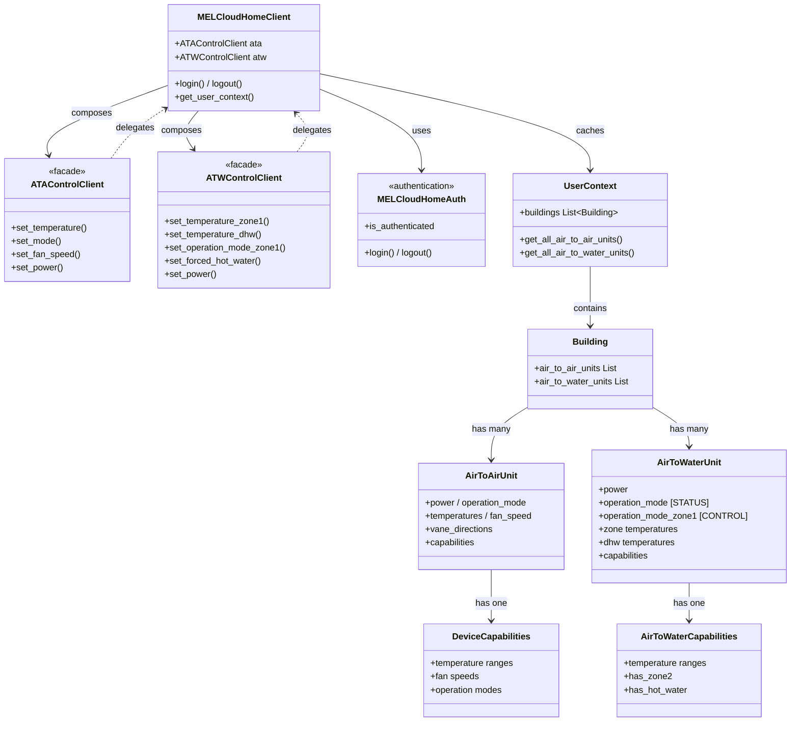
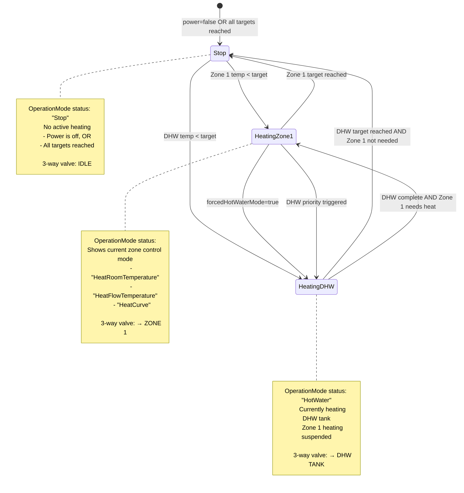

# MELCloud Home Integration - Architecture Overview

Visual architecture documentation for the MELCloud Home custom integration for Home Assistant.

**Last Updated:** 2026-01-03
**Related:** [ADR-011: Multi-Device-Type Architecture](decisions/011-multi-device-type-architecture.md)

---

## Key Architectural Principles

1. **Single Unified Client** - One `MELCloudHomeClient` handles both Air-to-Air and Air-to-Water devices
2. **Shared Authentication** - AWS Cognito OAuth session shared across all device types
3. **Multi-Type Container** - `UserContext` holds both device types in parallel arrays
4. **Device-Specific Methods** - Method names indicate which device type they control
5. **3-Way Valve Awareness** - A2W architecture reflects physical hardware limitation

---

## System Overview

High-level component architecture showing how Home Assistant entities connect to the MELCloud API through the integration layers.



**Key Points:**

- **Single coordinator** manages polling for all device types
- **Single client** provides unified API interface
- **Shared auth** handles OAuth for all endpoints
- **UserContext** endpoint returns both device types in one response

---

## ATW Entity Architecture

Air-to-Water heat pumps present a unique challenge: one physical device with multiple control aspects (system power, zone heating, DHW). See [ADR-012](decisions/012-atw-entity-architecture.md) for full rationale.

**Entity Responsibilities:**

| Entity | Controls | Rationale |
|--------|----------|-----------|
| **switch** | System power (ON/OFF) | Primary power control point. Standard HA pattern for system-level on/off. |
| **climate** | Zone temperature & heating method | Zone-specific control. HVAC mode OFF delegates to switch. |
| **water_heater** | DHW temperature & mode | DHW-specific control. Power state is read-only. |

**Key Point:** Heat pump is ONE device with one power supply. Switch controls system power. Climate and water_heater control their respective subsystems when the system is on.

**3-Way Valve Status:** Users can monitor valve position via `sensor.{device}_operation_status` (idle/heating_dhw/heating_zone_1) and `climate.hvac_action` (shows IDLE when valve on DHW).

---

## API Layer Structure

Files are organized by device type: `client_ata.py` (Air-to-Air), `client_atw.py` (Air-to-Water), with shared code in `client.py`, `auth.py`, and `models.py`. The `MELCloudHomeClient` composes device-specific facades (`client.ata`, `client.atw`) using the facade pattern. See [ADR-011](decisions/011-multi-device-type-architecture.md) for implementation details.

---

## Entity ID Strategy

All entities use UUID-based device names for stable entity IDs (format: `melcloudhome_<uuid>_<entity_type>`). Friendly device names are set via `name_by_user` in device registry.

**ATA (Air-to-Air):** `climate`, temperature/energy sensors, error/connection binary sensors

**ATW (Air-to-Water):** `switch` (system power), `climate` (zones), `water_heater` (DHW), temperature sensors, operation status sensor, error/connection/forced-DHW binary sensors

---

## Device Type Control Flow

Sequence diagram showing complete flow from authentication through control operations.



---

## Multi-Device Architecture

Showing the facade pattern and model relationships. Facade pattern provides device-type-specific control via `client.ata` and `client.atw`.



**Key Architectural Points:**

- **Facade Pattern:** `MELCloudHomeClient` composes `ATAControlClient` and `ATWControlClient` facades
- **Unified Entry Point:** Single client import, device-specific methods via `client.ata.*` and `client.atw.*`
- **Multi-Type Container:** `UserContext` holds both device types discovered from `/api/user/context`
- **Shared Authentication:** Single OAuth session serves all device types
- **Capabilities-Driven:** Each device has capabilities object defining valid operations/ranges

---

## A2W 3-Way Valve Behavior

State diagram showing how the Air-to-Water heat pump's 3-way valve determines what gets heated and how this affects the `OperationMode` status field.



### Physical System

```
Heat Pump → [3-Way Valve] → Zone 1 Heating
                    ↓
              DHW Tank Heating

Only ONE output active at a time
```

### Control Implications

**User sets:**

- `setTemperatureZone1`: 21°C (target)
- `setTankWaterTemperature`: 50°C (target)
- `forcedHotWaterMode`: false (no priority)
- `operationModeZone1`: "HeatRoomTemperature" (HOW to heat)

**System decides:**

- Current room temp: 19°C (< 21°C target) → needs heating
- Current DHW temp: 48°C (< 50°C target) → needs heating
- No forced mode → automatic balancing
- **OperationMode shows what's happening RIGHT NOW**

**Example sequence:**

1. System heats Zone 1 → `OperationMode: "HeatRoomTemperature"`
2. Zone reaches 21°C → switches to DHW
3. System heats DHW → `OperationMode: "HotWater"`
4. DHW reaches 50°C → switches back
5. Both at target → `OperationMode: "Stop"`

---


## Related Documentation

- **ADR-011:** [Multi-Device-Type Architecture](decisions/011-multi-device-type-architecture.md)
- **A2A API Reference:** [ata-api-reference.md](api/ata-api-reference.md)
- **A2W API Reference:** [atw-api-reference.md](api/atw-api-reference.md)
- **Device Comparison:** [device-type-comparison.md](api/device-type-comparison.md)
- **OpenAPI Spec:** [../openapi.yaml](../openapi.yaml)
