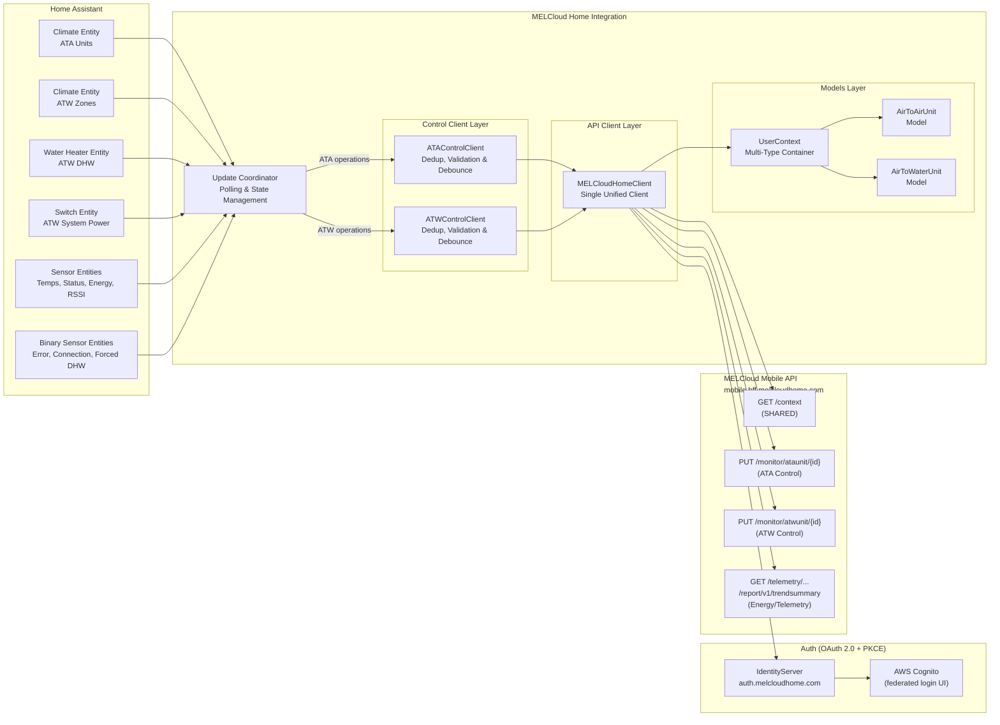
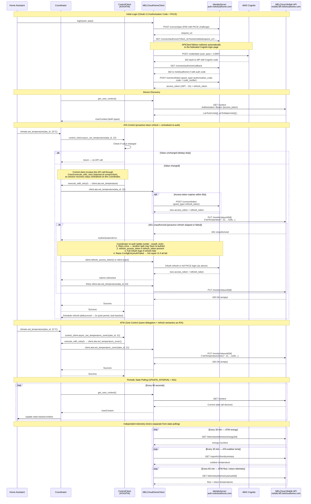
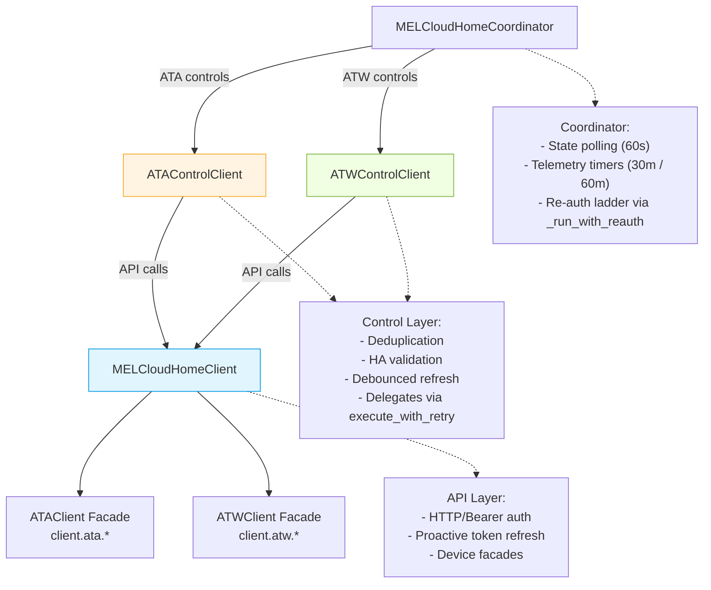
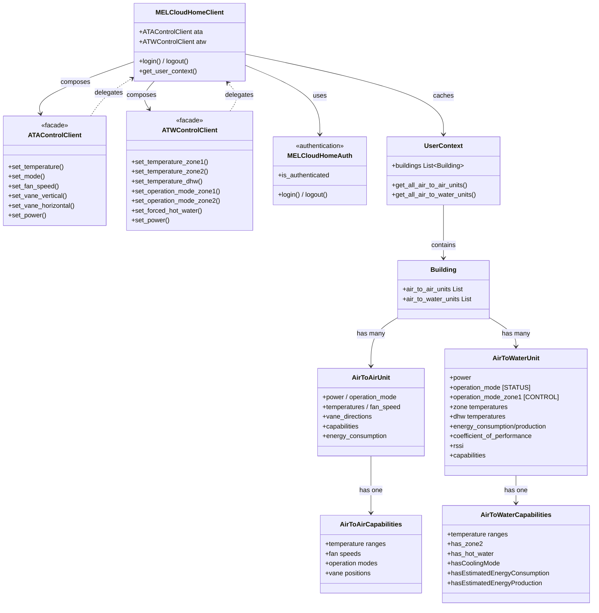
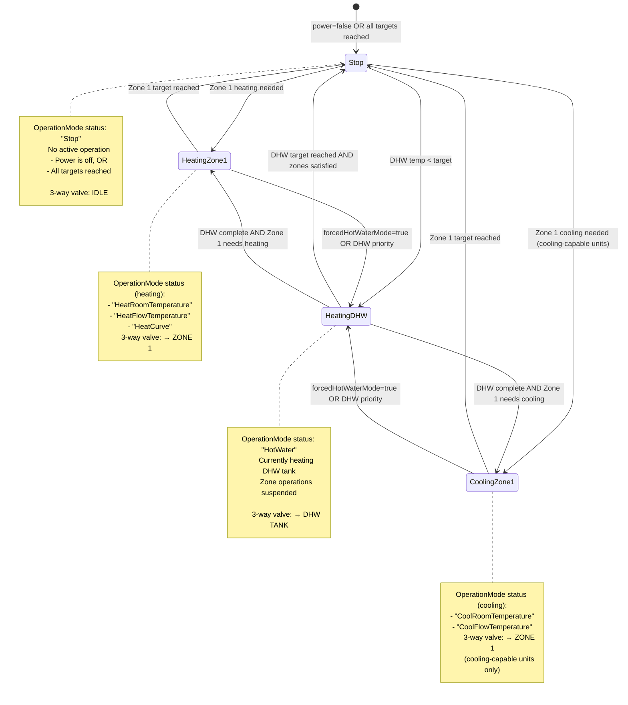

# MELCloud Home Integration - Architecture Overview

Visual architecture documentation for the MELCloud Home custom integration for Home Assistant.

**Last Updated:** 2026-04-20

**Terminology:** This document uses **ATA** (Air-to-Air) and **ATW** (Air-to-Water) to refer to the two device types.

---

## Key Architectural Principles

1. **Single Unified Client** - One `MELCloudHomeClient` handles both Air-to-Air and Air-to-Water devices
2. **Shared Authentication** - OAuth 2.0 Authorization Code + PKCE (via IdentityServer at `auth.melcloudhome.com`, with AWS Cognito federated for credential submission). Bearer access tokens + refresh tokens shared across all device types.
3. **Multi-Type Container** - `UserContext` holds both device types in parallel arrays
4. **Device-Specific Methods** - Method names indicate which device type they control
5. **Equal Device Type Support** - ATA and ATW devices have full feature parity in their respective domains

**API target:** MELCloud mobile API at `https://mobile.bff.melcloudhome.com` (see [ADR-017](decisions/017-migrate-to-mobile-bff.md)). Canonical endpoint/auth constants live in [`api/const_shared.py`](../custom_components/melcloudhome/api/const_shared.py).

---

## System Overview

High-level component architecture showing how Home Assistant entities connect to the MELCloud API through the integration layers.

```mermaid
graph LR
    subgraph "Home Assistant"
        ClimateATA[Climate Entity<br/>ATA Units]
        ClimateATW[Climate Entity<br/>ATW Zones]
        WaterHeater[Water Heater Entity<br/>ATW DHW]
        Switch[Switch Entity<br/>ATW System Power]
        Sensors[Sensor Entities<br/>Temps, Status, Energy, RSSI]
        BinarySensors[Binary Sensor Entities<br/>Error, Connection, Forced DHW]
    end

    subgraph "MELCloud Home Integration"
        Coordinator[Update Coordinator<br/>Polling & State Management]

        subgraph "Control Client Layer"
            ControlATA[ATAControlClient<br/>Dedup, Validation & Debounce]
            ControlATW[ATWControlClient<br/>Dedup, Validation & Debounce]
        end

        subgraph "Models Layer"
            ATAModel[AirToAirUnit<br/>Model]
            ATWModel[AirToWaterUnit<br/>Model]
            Context[UserContext<br/>Multi-Type Container]
        end
        subgraph "API Client Layer"
            Client[MELCloudHomeClient<br/>Single Unified Client]
        end

    end
    subgraph "MELCloud Mobile API<br/>mobile.bff.melcloudhome.com"
        UserContextAPI["GET /context<br/>(SHARED)"]
        ATAAPI["PUT /monitor/ataunit/{id}<br/>(ATA Control)"]
        ATWAPI["PUT /monitor/atwunit/{id}<br/>(ATW Control)"]
        TelemetryAPI["GET /telemetry/...<br/>/report/v1/trendsummary<br/>(Energy/Telemetry)"]
    end
    subgraph "Auth (OAuth 2.0 + PKCE)"
        IdP["IdentityServer<br/>auth.melcloudhome.com"]
        Cognito["AWS Cognito<br/>(federated login UI)"]
        IdP --> Cognito
    end

    ClimateATA --> Coordinator
    ClimateATW --> Coordinator
    WaterHeater --> Coordinator
    Switch --> Coordinator
    Sensors --> Coordinator
    BinarySensors --> Coordinator

    Coordinator -->|ATA operations| ControlATA
    Coordinator -->|ATW operations| ControlATW
    ControlATA --> Client
    ControlATW --> Client
    Client --> IdP
    Client --> Context

    Context --> ATAModel
    Context --> ATWModel

    Client --> UserContextAPI
    Client --> ATAAPI
    Client --> ATWAPI
    Client --> TelemetryAPI
```

**Key Points:**

- **Single coordinator** drives state polling and owns session recovery (`_run_with_reauth`)
- **Control client layer** provides deduplication, HA validation, and debounced refresh; it delegates every API call through `Coord.execute_with_retry`
- **Single API client** provides unified interface to the MELCloud mobile API, plus proactive token refresh (60s pre-expiry buffer)
- **Shared auth** — one OAuth session (access + refresh tokens) for all endpoints
- **UserContext** (`/context`) returns both device types in one response
- **Telemetry** is separate from state polling — `/telemetry/...` (30m energy, 60m flow/return) and `/report/v1/trendsummary` (30m ATA outdoor temp) each run on independent timers

---

## Device Type Feature Comparison

Both ATA and ATW devices have comprehensive support for their respective HVAC system types.

### ATA (Air-to-Air) Features

**Primary Entity:** Climate control for heating/cooling

**Capabilities:**

- HVAC modes: Heat, Cool, Dry, Fan Only, Auto
- Temperature control with device-specific ranges
- Fan speed control (Auto, Low through High)
- Vertical and horizontal vane direction control
- Power on/off

**Sensors:**

- Room temperature
- Energy consumption (daily, weekly, monthly)
- Connection status
- Error states

**Hardware:** Mini-split air conditioning units, typically wall-mounted indoor units with outdoor compressor.

### ATW (Air-to-Water) Features

**Primary Entities:** System power switch, zone climate control, DHW water heater

**Capabilities:**

- **Heating modes:** HeatRoomTemperature, HeatFlowTemperature, HeatCurve
- **Cooling modes:** CoolRoomTemperature, CoolFlowTemperature (on cooling-capable units)
- **Zone control:** Independent temperature targets per zone
- **DHW control:** Tank temperature and operating modes
- **3-way valve:** Automatic switching between zone heating and DHW
- **Forced DHW mode:** Priority DHW heating when enabled

**Sensors:**

- Zone temperatures (1-2 zones depending on configuration)
- DHW tank temperature
- Outside temperature
- Flow temperature
- Return temperature
- Energy monitoring: consumed, produced, COP (on capable units)
- RSSI signal strength
- Operation status (idle/heating/cooling/DHW)

**Binary Sensors:**

- Connection status
- Error states
- Forced DHW mode active

**Hardware:** Heat pump systems for whole-home heating/cooling via radiators or underfloor heating, with integrated DHW tank heating.

### Capability Detection

Both device types use capability objects to determine supported features:

- **ATA:** `AirToAirCapabilities` defines temperature ranges, fan speeds, operation modes, vane positions
- **ATW:** `AirToWaterCapabilities` defines temperature ranges, zone availability (`has_zone2`), DHW support (`has_hot_water`), cooling support (`hasCoolingMode`), energy monitoring (`hasEstimatedEnergyConsumption`, `hasEstimatedEnergyProduction`)

All features are auto-detected via capabilities API - no hardcoded controller checks.

---

## ATW Entity Architecture

Air-to-Water heat pumps present a unique challenge: one physical device with multiple control aspects (system power, zone heating/cooling, DHW). See [ADR-012](decisions/012-atw-entity-architecture.md) for full rationale.

**Entity Responsibilities:**

| Entity | Controls | Rationale |
|--------|----------|-----------|
| **switch** | System power (ON/OFF) | Primary power control point. Standard HA pattern for system-level on/off. |
| **climate** | Zone temperature & heating/cooling method | Zone-specific control. HVAC mode OFF delegates to switch. |
| **water_heater** | DHW temperature & mode | DHW-specific control. Power state is read-only. |

**Key Point:** Heat pump is ONE device with one power supply. Switch controls system power. Climate and water_heater control their respective subsystems when the system is on.

**3-Way Valve Status:** Users can monitor valve position via `sensor.{device}_operation_status` (idle/heating_dhw/heating_zone_1/cooling_zone_1) and `climate.hvac_action` (shows IDLE when valve on DHW).

---

## API Layer Structure

Files are organized by device type: `client_ata.py` (Air-to-Air), `client_atw.py` (Air-to-Water), with shared code in `client.py`, `auth.py`, and `models.py`. The `MELCloudHomeClient` composes device-specific facades (`client.ata`, `client.atw`) using the facade pattern. See [ADR-011](decisions/011-multi-device-type-architecture.md) for implementation details.

---

## Entity ID Strategy

All entities use UUID-based device names for stable entity IDs (format: `melcloudhome_{short_id}_{entity_type}` where short_id is first 4 + last 4 chars of UUID). Friendly device names are set via `name_by_user` in device registry.

**ATA (Air-to-Air) Entities:**

- `climate.melcloudhome_{short_id}_climate` - Main climate control
- `sensor.melcloudhome_{short_id}_room_temperature` - Current temperature
- `sensor.melcloudhome_{short_id}_energy_*` - Energy consumption (daily/weekly/monthly)
- `binary_sensor.melcloudhome_{short_id}_error` - Error state
- `binary_sensor.melcloudhome_{short_id}_connection` - Connection status

**ATW (Air-to-Water) Entities:**

- `switch.melcloudhome_{short_id}_system_power` - System power control
- `climate.melcloudhome_{short_id}_zone_1` - Zone 1 climate control
- `climate.melcloudhome_{short_id}_zone_2` - Zone 2 climate control (if available)
- `water_heater.melcloudhome_{short_id}_tank` - DHW tank control
- `sensor.melcloudhome_{short_id}_zone_*_temperature` - Zone temperatures
- `sensor.melcloudhome_{short_id}_tank_temperature` - DHW tank temperature
- `sensor.melcloudhome_{short_id}_outside_temperature` - Outside temperature
- `sensor.melcloudhome_{short_id}_flow_temperature` - Flow temperature
- `sensor.melcloudhome_{short_id}_return_temperature` - Return temperature
- `sensor.melcloudhome_{short_id}_energy_*` - Energy sensors (if supported)
- `sensor.melcloudhome_{short_id}_wifi_signal` - WiFi signal strength (RSSI)
- `sensor.melcloudhome_{short_id}_operation_status` - Current operation mode
- `binary_sensor.melcloudhome_{short_id}_error` - Error state
- `binary_sensor.melcloudhome_{short_id}_connection` - Connection status
- `binary_sensor.melcloudhome_{short_id}_forced_dhw` - Forced DHW mode active

---

## Device Type Control Flow

Sequence diagram showing complete flow from authentication through control operations. Control clients delegate to the coordinator's `execute_with_retry` wrapper, so session recovery stays centralised on the Coordinator (`_run_with_reauth`). The API client handles proactive token refresh itself.

```mermaid
sequenceDiagram
    participant HA as Home Assistant
    participant Coord as Coordinator
    participant CtrlClient as ControlClient<br/>(ATA/ATW)
    participant APIClient as MELCloudHomeClient
    participant IdP as IdentityServer<br/>auth.melcloudhome.com
    participant Cognito as AWS Cognito
    participant Server as MELCloud Mobile API<br/>mobile.bff.melcloudhome.com

    Note over HA,Server: Initial Login (OAuth 2.0 Authorization Code + PKCE)
    HA->>APIClient: login(user, pass)
    APIClient->>IdP: POST /connect/par (PAR with PKCE challenge)
    IdP-->>APIClient: request_uri
    APIClient->>IdP: GET /connect/authorize?client_id=homemobile&request_uri=...
    Note over APIClient,Cognito: APIClient follows redirects automatically<br/>to the federated Cognito login page
    APIClient->>Cognito: POST credentials (user, pass + CSRF)
    Cognito-->>APIClient: 302 back to IdP with Cognito code
    APIClient->>IdP: GET /connect/authorize/callback
    IdP-->>APIClient: 302 to melcloudhome:// with auth code
    APIClient->>IdP: POST /connect/token (grant_type=authorization_code,<br/>code + code_verifier)
    IdP-->>APIClient: access_token (JWT, ~1h) + refresh_token

    Note over HA,Server: Device Discovery
    Coord->>APIClient: get_user_context()
    APIClient->>Server: GET /context<br/>Authorization: Bearer {access_token}
    Server-->>APIClient: { airToAirUnits[], airToWaterUnits[] }
    APIClient-->>Coord: UserContext (both types)

    Note over HA,Server: ATA Control (proactive token refresh + centralised re-auth)
    HA->>Coord: climate.set_temperature(ata_id, 22°C)
    Coord->>CtrlClient: control_client.async_set_temperature(ata_id, 22)
    CtrlClient->>CtrlClient: Check if value changed
    alt Value unchanged (dedup skip)
        CtrlClient-->>Coord: return — no API call
    else Value changed
        Note over Coord,CtrlClient: Control client invokes the API call through<br/>Coord.execute_with_retry (injected at construction),<br/>so session recovery stays centralised on the Coordinator.
        CtrlClient->>Coord: execute_with_retry(λ → client.ata.set_temperature)
        Coord->>APIClient: client.ata.set_temperature(ata_id, 22)
        opt Access token expires within 60s
            APIClient->>IdP: POST /connect/token<br/>(grant_type=refresh_token)
            IdP-->>APIClient: new access_token + refresh_token
        end
        APIClient->>Server: PUT /monitor/ataunit/{id}<br/>{"setTemperature": 22, ...nulls...}
        alt 401 Unauthorized (proactive refresh skipped or failed)
            Server-->>APIClient: 401 Unauthorized
            APIClient-->>Coord: AuthenticationError
            Note over Coord,IdP: Coordinator re-auth ladder (under _reauth_lock):<br/>1. Retry once — another task may have re-authed<br/>2. refresh_access_token if refresh_token present<br/>3. Full OAuth login if refresh fails<br/>4. Raise ConfigEntryAuthFailed → HA repair UI if all fail
            Coord->>APIClient: client.refresh_access_token() or client.login()
            APIClient->>IdP: OAuth refresh or full PKCE login (as above)
            IdP-->>APIClient: new access_token + refresh_token
            APIClient-->>Coord: tokens refreshed
            Coord->>APIClient: Retry client.ata.set_temperature(ata_id, 22)
            APIClient->>Server: PUT /monitor/ataunit/{id}
        end
        Server-->>APIClient: 200 OK (empty)
        APIClient-->>Coord: Success
        Coord-->>CtrlClient: Success
        CtrlClient->>Coord: Schedule refresh (debounced — 2s quiet period, task-backed)
    end

    Note over HA,Server: ATW Zone Control (same delegation + refresh semantics as ATA)
    HA->>Coord: climate.set_temperature(atw_id, 21°C)
    Coord->>CtrlClient: control_client.async_set_temperature_zone1(atw_id, 21)
    CtrlClient->>Coord: execute_with_retry(λ → client.atw.set_temperature_zone1)
    Coord->>APIClient: client.atw.set_temperature_zone1(atw_id, 21)
    APIClient->>Server: PUT /monitor/atwunit/{id}<br/>{"setTemperatureZone1": 21, ...nulls...}
    Server-->>APIClient: 200 OK (empty)
    APIClient-->>Coord: Success
    Coord-->>CtrlClient: Success

    Note over HA,Server: Periodic State Polling (UPDATE_INTERVAL = 60s)
    loop Every 60 seconds
        Coord->>APIClient: get_user_context()
        APIClient->>Server: GET /context
        Server-->>APIClient: Current state (all devices)
        APIClient-->>Coord: UserContext
        Coord->>HA: Update state-backed entities
    end

    Note over HA,Server: Independent telemetry timers (separate from state polling)
    loop Every 30 min — ATW energy
        APIClient->>Server: GET /telemetry/telemetry/energy/{id}
        Server-->>APIClient: energy counters
    end
    loop Every 30 min — ATA outdoor temp
        APIClient->>Server: GET /report/v1/trendsummary
        Server-->>APIClient: outdoor temperature
    end
    loop Every 60 min — ATW flow / return telemetry
        APIClient->>Server: GET /telemetry/telemetry/actual/{id}
        Server-->>APIClient: flow + return temperatures
    end
```

**API Client Responsibilities (`MELCloudHomeClient`):**

- **Proactive token refresh**: Before each request, refreshes the access token if it expires within 60 seconds. A shared lock prevents concurrent refreshes from burning single-use refresh tokens.
- **Bearer injection**: Adds `Authorization: Bearer {access_token}` and the mobile `User-Agent` to every MELCloud API call.
- **401 → `AuthenticationError`**: If a request still returns 401 (e.g. refresh unavailable or failed), the API client raises `AuthenticationError`. It does not attempt re-login itself.

**Control Client Responsibilities (`control_client_{ata,atw}.py`):**

- **Deduplication**: Skips API calls when the requested value already matches current device state.
- **HA-specific validation**: Checks zone availability, temperature ranges, capability support before hitting the API.
- **Debounced refresh**: Coalesces rapid consecutive changes into a single follow-up state fetch after a 2-second quiet period (see `control_client_base.py`).
- **Delegation to the coordinator's retry wrapper**: Every API call is invoked through `execute_with_retry` (a callback injected from the coordinator at construction), so session recovery is owned in one place.

**Coordinator Responsibilities (`MELCloudHomeCoordinator`):**

- **State polling**: Drives the 60-second `/context` refresh loop; dispatches updates to all platforms.
- **Independent telemetry timers**: Separate 30-minute energy timer, 30-minute ATA outdoor-temperature timer (via `/report/v1/trendsummary`), and 60-minute ATW flow/return telemetry timer.
- **Re-auth ladder** (`_run_with_reauth`, guarded by `_reauth_lock`): retry-once → refresh_token → full login → `ConfigEntryAuthFailed` (triggers HA repair UI) if all fail. This is the single place in the integration that runs re-login on auth failure.

---

## Integration Layer Architecture

Shows the control client layer that sits between the coordinator and API client, providing deduplication, HA-specific validation, and debounced refresh. Session recovery lives on the coordinator (`_run_with_reauth`) — see the Device Type Control Flow sequence diagram above.

```mermaid
graph TD
    Coordinator[MELCloudHomeCoordinator]
    ControlATA[ATAControlClient]
    ControlATW[ATWControlClient]
    APIClient[MELCloudHomeClient]
    ATAAPI[ATAClient Facade<br/>client.ata.*]
    ATWAPI[ATWClient Facade<br/>client.atw.*]

    Coordinator -->|ATA controls| ControlATA
    Coordinator -->|ATW controls| ControlATW
    ControlATA -->|API calls| APIClient
    ControlATW -->|API calls| APIClient
    APIClient --> ATAAPI
    APIClient --> ATWAPI

    style ControlATA fill:#fff4e1,stroke:#f9a825
    style ControlATW fill:#f0ffe1,stroke:#7cb342
    style APIClient fill:#e1f5ff,stroke:#039be5

    note0["Coordinator:<br/>- State polling (60s)<br/>- Telemetry timers (30m / 60m)<br/>- Re-auth ladder via _run_with_reauth"]
    note1["Control Layer:<br/>- Deduplication<br/>- HA validation<br/>- Debounced refresh<br/>- Delegates via execute_with_retry"]
    note2["API Layer:<br/>- HTTP/Bearer auth<br/>- Proactive token refresh<br/>- Device facades"]

    Coordinator -.-> note0
    ControlATA -.-> note1
    ControlATW -.-> note1
    APIClient -.-> note2
```

**Key Points:**

- **Two separate control client files**: `control_client_ata.py` and `control_client_atw.py`.
- **Coordinator owns session recovery + retry**: the re-auth ladder is in `_run_with_reauth` on the coordinator; control clients never catch `AuthenticationError` themselves.
- **Control clients own dedup + validation + debouncing**: they skip API calls when state already matches, validate HA-side preconditions, and coalesce rapid refreshes.
- **API client owns HTTP/auth/facades**: Bearer injection, proactive token refresh, and the `client.ata.*` / `client.atw.*` device facades.
- **All operations flow Coord → CtrlClient → Coord.execute_with_retry → APIClient**: control clients never call the API client directly.

---

## Multi-Device Architecture

Showing the facade pattern and model relationships. Facade pattern provides device-type-specific control via `client.ata` and `client.atw`.

```mermaid
classDiagram
    class MELCloudHomeClient {
        +ATAControlClient ata
        +ATWControlClient atw
        +login() / logout()
        +get_user_context()
    }

    class ATAControlClient {
        <<facade>>
        +set_temperature()
        +set_mode()
        +set_fan_speed()
        +set_vane_vertical()
        +set_vane_horizontal()
        +set_power()
    }

    class ATWControlClient {
        <<facade>>
        +set_temperature_zone1()
        +set_temperature_zone2()
        +set_temperature_dhw()
        +set_operation_mode_zone1()
        +set_operation_mode_zone2()
        +set_forced_hot_water()
        +set_power()
    }

    class MELCloudHomeAuth {
        <<authentication>>
        +login() / logout()
        +is_authenticated
    }

    class UserContext {
        +buildings List~Building~
        +get_all_air_to_air_units()
        +get_all_air_to_water_units()
    }

    class Building {
        +air_to_air_units List
        +air_to_water_units List
    }

    class AirToAirUnit {
        +power / operation_mode
        +temperatures / fan_speed
        +vane_directions
        +capabilities
        +energy_consumption
    }

    class AirToWaterUnit {
        +power
        +operation_mode [STATUS]
        +operation_mode_zone1 [CONTROL]
        +zone temperatures
        +dhw temperatures
        +energy_consumption/production
        +coefficient_of_performance
        +rssi
        +capabilities
    }

    class AirToAirCapabilities {
        +temperature ranges
        +fan speeds
        +operation modes
        +vane positions
    }

    class AirToWaterCapabilities {
        +temperature ranges
        +has_zone2
        +has_hot_water
        +hasCoolingMode
        +hasEstimatedEnergyConsumption
        +hasEstimatedEnergyProduction
    }

    MELCloudHomeClient --> MELCloudHomeAuth : uses
    MELCloudHomeClient --> ATAControlClient : composes
    MELCloudHomeClient --> ATWControlClient : composes
    ATAControlClient ..> MELCloudHomeClient : delegates
    ATWControlClient ..> MELCloudHomeClient : delegates
    MELCloudHomeClient --> UserContext : caches
    UserContext --> Building : contains
    Building --> AirToAirUnit : has many
    Building --> AirToWaterUnit : has many
    AirToAirUnit --> AirToAirCapabilities : has one
    AirToWaterUnit --> AirToWaterCapabilities : has one
```

**Key Architectural Points:**

- **Facade Pattern:** `MELCloudHomeClient` composes `ATAControlClient` and `ATWControlClient` facades
- **Unified Entry Point:** Single client import, device-specific methods via `client.ata.*` and `client.atw.*`
- **Multi-Type Container:** `UserContext` holds both device types discovered from `/context`
- **Shared Authentication:** Single OAuth session (access + refresh tokens) serves all device types
- **Capabilities-Driven:** Each device has capabilities object defining valid operations/ranges

---

## ATW 3-Way Valve Behavior

State diagram showing how the Air-to-Water heat pump's 3-way valve determines what gets heated/cooled and how this affects the `OperationMode` status field.

```mermaid
stateDiagram-v2
    [*] --> Stop: power=false OR all targets reached
    Stop --> HeatingZone1: Zone 1 heating needed
    Stop --> CoolingZone1: Zone 1 cooling needed (cooling-capable units)
    Stop --> HeatingDHW: DHW temp < target

    HeatingZone1 --> Stop: Zone 1 target reached
    HeatingZone1 --> HeatingDHW: forcedHotWaterMode=true OR DHW priority

    CoolingZone1 --> Stop: Zone 1 target reached
    CoolingZone1 --> HeatingDHW: forcedHotWaterMode=true OR DHW priority

    HeatingDHW --> Stop: DHW target reached AND zones satisfied
    HeatingDHW --> HeatingZone1: DHW complete AND Zone 1 needs heating
    HeatingDHW --> CoolingZone1: DHW complete AND Zone 1 needs cooling

    note right of Stop
        OperationMode status: "Stop"

        No active operation
        - Power is off, OR
        - All targets reached

        3-way valve: IDLE
    end note

    note right of HeatingDHW
        OperationMode status: "HotWater"

        Currently heating DHW tank
        Zone operations suspended

        3-way valve: → DHW TANK
    end note

    note right of HeatingZone1
        OperationMode status (heating):
        - "HeatRoomTemperature"
        - "HeatFlowTemperature"
        - "HeatCurve"

        3-way valve: → ZONE 1
    end note

    note right of CoolingZone1
        OperationMode status (cooling):
        - "CoolRoomTemperature"
        - "CoolFlowTemperature"

        3-way valve: → ZONE 1
        (cooling-capable units only)
    end note
```

### Control Implications

**User sets:**

- `setTemperatureZone1`: 21°C (heating) or 24°C (cooling)
- `setTankWaterTemperature`: 50°C (target)
- `forcedHotWaterMode`: false (no priority)
- `operationModeZone1`: "HeatRoomTemperature" or "CoolRoomTemperature" (HOW to operate)

**System decides:**

- Current room temp vs target → determines heating/cooling need
- Current DHW temp vs target → determines DHW need
- Forced mode setting → affects priority
- **OperationMode shows what's happening RIGHT NOW**

**Example sequence (heating season):**

1. System heats Zone 1 → `OperationMode: "HeatRoomTemperature"`
2. Zone reaches 21°C → switches to DHW
3. System heats DHW → `OperationMode: "HotWater"`
4. DHW reaches 50°C → switches back to zones if needed
5. Both at target → `OperationMode: "Stop"`

**Example sequence (cooling season, cooling-capable units):**

1. System cools Zone 1 → `OperationMode: "CoolRoomTemperature"`
2. Zone reaches 24°C → switches to DHW if needed
3. System heats DHW → `OperationMode: "HotWater"` (DHW always heating)
4. DHW complete → returns to cooling if needed
5. Both at target → `OperationMode: "Stop"`

---

## ATW Energy Monitoring

Available on devices with both capability flags enabled:

- `hasEstimatedEnergyConsumption: true`
- `hasEstimatedEnergyProduction: true`

**Sensors Provided:**

- Energy consumed (kWh) - electrical energy input for heating/cooling/DHW
- Energy produced (kWh) - thermal energy output delivered to zones/DHW
- Coefficient of Performance (COP) - ratio of produced/consumed (efficiency metric)

**Controller Support:**

- ERSC-VM2D controllers: Full energy monitoring support
- EHSCVM2D controllers: No energy monitoring (capability flags false)

Energy data is polled on its own 30-minute timer (`UPDATE_INTERVAL_ENERGY`), independent of the main 60-second `/context` state poll. Energy counters change slowly, so a faster cadence would waste API calls without giving users more resolution.

---

## Related Documentation

- **ADR-011:** [Multi-Device-Type Architecture](decisions/011-multi-device-type-architecture.md)
- **ADR-012:** [ATW Entity Architecture](decisions/012-atw-entity-architecture.md)
- **ADR-016:** [ATW Energy Monitoring Implementation](decisions/016-implement-atw-energy-monitoring.md)
- **ADR-017:** [Migrate to Mobile BFF API](decisions/017-migrate-to-mobile-bff.md) (supersedes ADR-002)
- **ATA API Reference:** [ata-api-reference.md](api/ata-api-reference.md)
- **ATW API Reference:** [atw-api-reference.md](api/atw-api-reference.md)
- **Device Comparison:** [device-type-comparison.md](api/device-type-comparison.md)
- **Mobile API Capture Notes:** [research/mobile-bff-captures/README.md](research/mobile-bff-captures/README.md)
