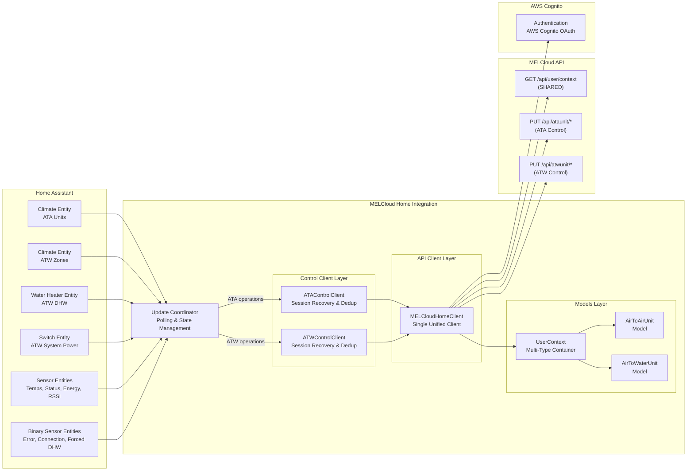
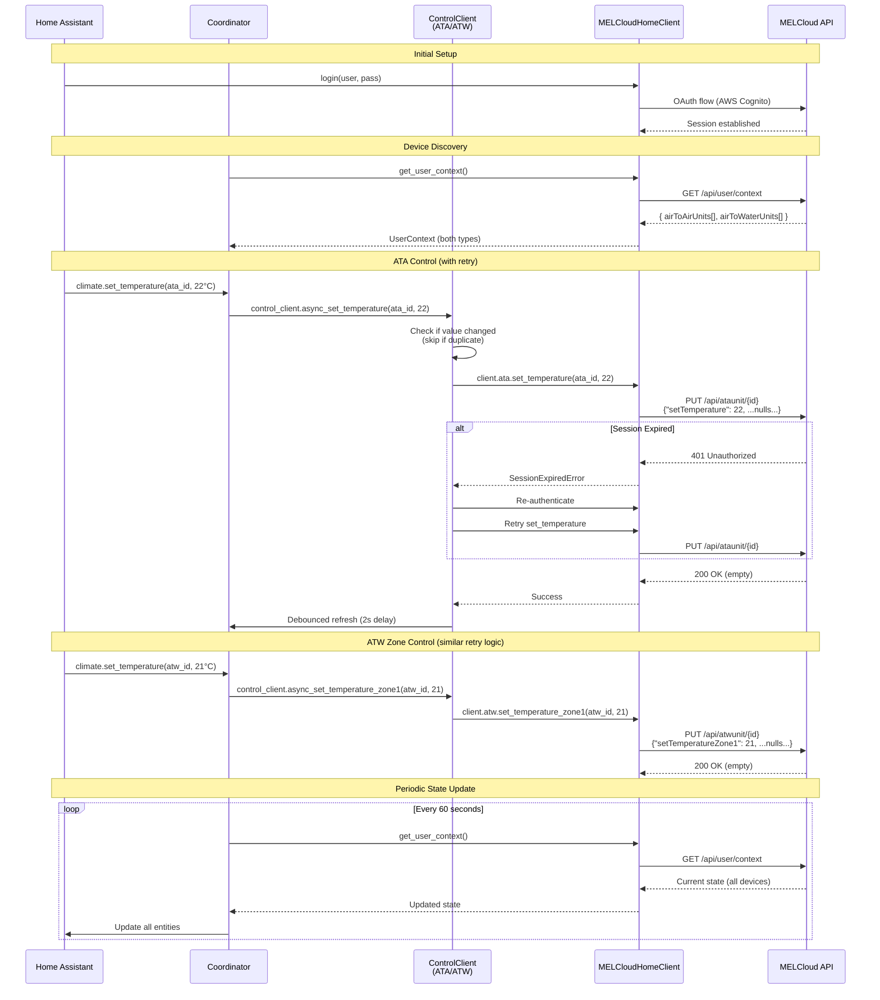
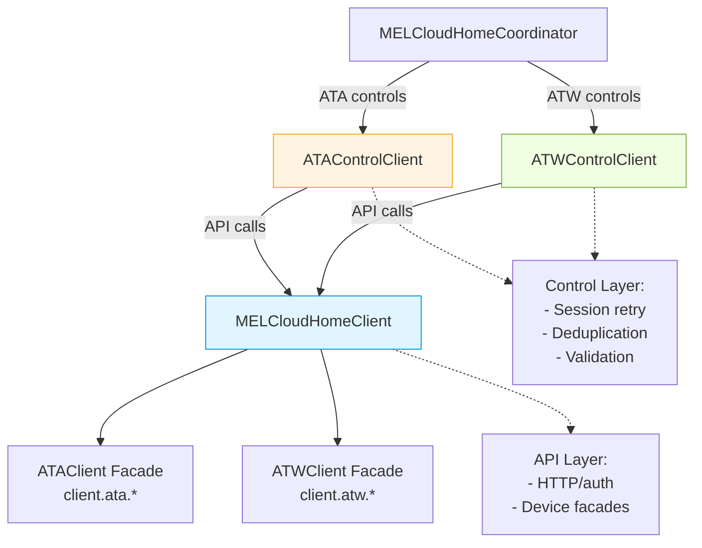
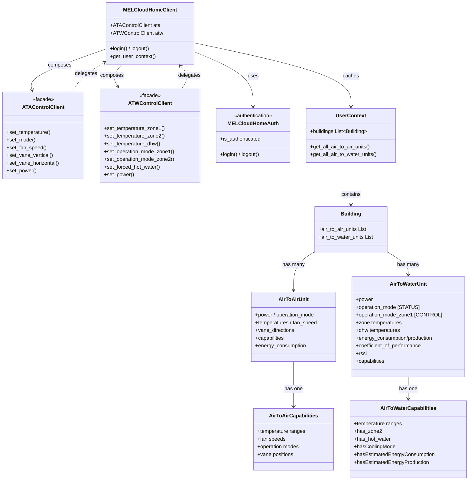
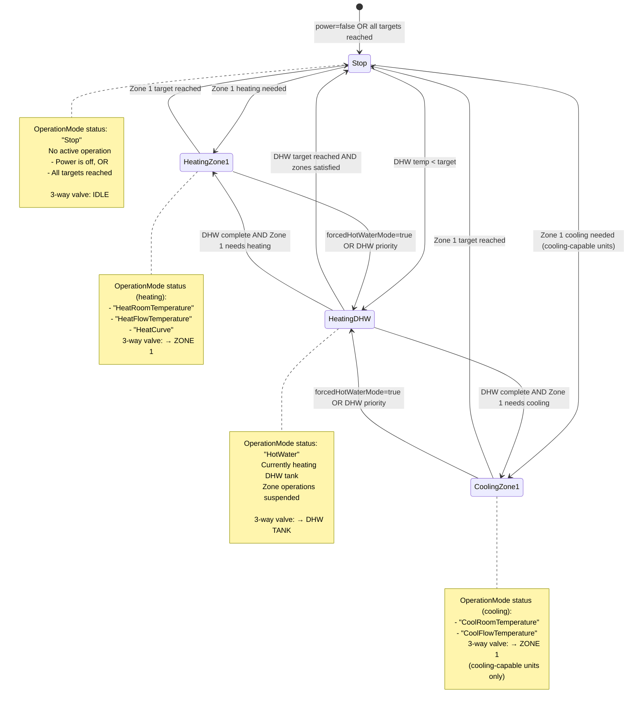

# MELCloud Home Integration - Architecture Overview

Visual architecture documentation for the MELCloud Home custom integration for Home Assistant.

**Last Updated:** 2026-01-18

**Terminology:** This document uses **ATA** (Air-to-Air) and **ATW** (Air-to-Water) to refer to the two device types.

---

## Key Architectural Principles

1. **Single Unified Client** - One `MELCloudHomeClient` handles both Air-to-Air and Air-to-Water devices
2. **Shared Authentication** - AWS Cognito OAuth session shared across all device types
3. **Multi-Type Container** - `UserContext` holds both device types in parallel arrays
4. **Device-Specific Methods** - Method names indicate which device type they control
5. **Equal Device Type Support** - ATA and ATW devices have full feature parity in their respective domains

---

## System Overview

High-level component architecture showing how Home Assistant entities connect to the MELCloud API through the integration layers.

**Key Points:**

- **Single coordinator** manages polling for all device types
- **Control client layer** provides deduplication, retry logic, and session recovery
- **Single API client** provides unified interface to MELCloud API
- **Shared auth** handles OAuth for all endpoints
- **UserContext** endpoint returns both device types in one response

---

## Device Type Feature Comparison

Both ATA and ATW devices have comprehensive support for their respective HVAC system types.

### ATA (Air-to-Air) Features

**Primary Entity:** Climate control for heating/cooling

**Capabilities:**

- HVAC modes: Heat, Cool, Dry, Fan Only, Auto
- Temperature control with device-specific ranges
- Fan speed control (Auto, Low through High)
- Vertical and horizontal vane direction control
- Power on/off

**Sensors:**

- Room temperature
- Energy consumption (daily, weekly, monthly)
- Connection status
- Error states

**Hardware:** Mini-split air conditioning units, typically wall-mounted indoor units with outdoor compressor.

### ATW (Air-to-Water) Features

**Primary Entities:** System power switch, zone climate control, DHW water heater

**Capabilities:**

- **Heating modes:** HeatRoomTemperature, HeatFlowTemperature, HeatCurve
- **Cooling modes:** CoolRoomTemperature, CoolFlowTemperature (on cooling-capable units)
- **Zone control:** Independent temperature targets per zone
- **DHW control:** Tank temperature and operating modes
- **3-way valve:** Automatic switching between zone heating and DHW
- **Forced DHW mode:** Priority DHW heating when enabled

**Sensors:**

- Zone temperatures (1-2 zones depending on configuration)
- DHW tank temperature
- Outside temperature
- Flow temperature
- Return temperature
- Energy monitoring: consumed, produced, COP (on capable units)
- RSSI signal strength
- Operation status (idle/heating/cooling/DHW)

**Binary Sensors:**

- Connection status
- Error states
- Forced DHW mode active

**Hardware:** Heat pump systems for whole-home heating/cooling via radiators or underfloor heating, with integrated DHW tank heating.

### Capability Detection

Both device types use capability objects to determine supported features:

- **ATA:** `AirToAirCapabilities` defines temperature ranges, fan speeds, operation modes, vane positions
- **ATW:** `AirToWaterCapabilities` defines temperature ranges, zone availability (`has_zone2`), DHW support (`has_hot_water`), cooling support (`hasCoolingMode`), energy monitoring (`hasEstimatedEnergyConsumption`, `hasEstimatedEnergyProduction`)

All features are auto-detected via capabilities API - no hardcoded controller checks.

---

## ATW Entity Architecture

Air-to-Water heat pumps present a unique challenge: one physical device with multiple control aspects (system power, zone heating/cooling, DHW). See [ADR-012](decisions/012-atw-entity-architecture.md) for full rationale.

**Entity Responsibilities:**

| Entity | Controls | Rationale |
|--------|----------|-----------|
| **switch** | System power (ON/OFF) | Primary power control point. Standard HA pattern for system-level on/off. |
| **climate** | Zone temperature & heating/cooling method | Zone-specific control. HVAC mode OFF delegates to switch. |
| **water_heater** | DHW temperature & mode | DHW-specific control. Power state is read-only. |

**Key Point:** Heat pump is ONE device with one power supply. Switch controls system power. Climate and water_heater control their respective subsystems when the system is on.

**3-Way Valve Status:** Users can monitor valve position via `sensor.{device}_operation_status` (idle/heating_dhw/heating_zone_1/cooling_zone_1) and `climate.hvac_action` (shows IDLE when valve on DHW).

---

## API Layer Structure

Files are organized by device type: `client_ata.py` (Air-to-Air), `client_atw.py` (Air-to-Water), with shared code in `client.py`, `auth.py`, and `models.py`. The `MELCloudHomeClient` composes device-specific facades (`client.ata`, `client.atw`) using the facade pattern. See [ADR-011](decisions/011-multi-device-type-architecture.md) for implementation details.

---

## Entity ID Strategy

All entities use UUID-based device names for stable entity IDs (format: `melcloudhome_{short_id}_{entity_type}` where short_id is first 4 + last 4 chars of UUID). Friendly device names are set via `name_by_user` in device registry.

**ATA (Air-to-Air) Entities:**

- `climate.melcloudhome_{short_id}_climate` - Main climate control
- `sensor.melcloudhome_{short_id}_room_temperature` - Current temperature
- `sensor.melcloudhome_{short_id}_energy_*` - Energy consumption (daily/weekly/monthly)
- `binary_sensor.melcloudhome_{short_id}_error` - Error state
- `binary_sensor.melcloudhome_{short_id}_connection` - Connection status

**ATW (Air-to-Water) Entities:**

- `switch.melcloudhome_{short_id}_system_power` - System power control
- `climate.melcloudhome_{short_id}_zone_1` - Zone 1 climate control
- `climate.melcloudhome_{short_id}_zone_2` - Zone 2 climate control (if available)
- `water_heater.melcloudhome_{short_id}_tank` - DHW tank control
- `sensor.melcloudhome_{short_id}_zone_*_temperature` - Zone temperatures
- `sensor.melcloudhome_{short_id}_tank_temperature` - DHW tank temperature
- `sensor.melcloudhome_{short_id}_outside_temperature` - Outside temperature
- `sensor.melcloudhome_{short_id}_flow_temperature` - Flow temperature
- `sensor.melcloudhome_{short_id}_return_temperature` - Return temperature
- `sensor.melcloudhome_{short_id}_energy_*` - Energy sensors (if supported)
- `sensor.melcloudhome_{short_id}_wifi_signal` - WiFi signal strength (RSSI)
- `sensor.melcloudhome_{short_id}_operation_status` - Current operation mode
- `binary_sensor.melcloudhome_{short_id}_error` - Error state
- `binary_sensor.melcloudhome_{short_id}_connection` - Connection status
- `binary_sensor.melcloudhome_{short_id}_forced_dhw` - Forced DHW mode active

---

## Device Type Control Flow

Sequence diagram showing complete flow from authentication through control operations, including the control client layer that handles retry logic and session recovery.

**Control Client Responsibilities:**

- **Session recovery**: Automatically re-authenticates and retries on 401 errors
- **Deduplication**: Skips API calls when value hasn't changed
- **Debounced refresh**: Coordinates state refresh with 2-second delay for rapid calls
- **HA-specific validation**: Checks zone availability, temperature ranges, capability support

---

## Integration Layer Architecture

Shows the control client layer that sits between the coordinator and API client, providing session recovery and HA-specific logic.

**Key Points:**

- **Two separate control client files**: `control_client_ata.py` and `control_client_atw.py`
- **Integration-level concerns**: Session recovery, retry logic, state deduplication
- **API-level concerns**: HTTP communication, authentication, device-type facades
- **Coordinator delegates**: All control operations go through control clients, never directly to API client

---

## Multi-Device Architecture

Showing the facade pattern and model relationships. Facade pattern provides device-type-specific control via `client.ata` and `client.atw`.

**Key Architectural Points:**

- **Facade Pattern:** `MELCloudHomeClient` composes `ATAControlClient` and `ATWControlClient` facades
- **Unified Entry Point:** Single client import, device-specific methods via `client.ata.*` and `client.atw.*`
- **Multi-Type Container:** `UserContext` holds both device types discovered from `/api/user/context`
- **Shared Authentication:** Single OAuth session serves all device types
- **Capabilities-Driven:** Each device has capabilities object defining valid operations/ranges

---

## ATW 3-Way Valve Behavior

State diagram showing how the Air-to-Water heat pump's 3-way valve determines what gets heated/cooled and how this affects the `OperationMode` status field.

### Control Implications

**User sets:**

- `setTemperatureZone1`: 21°C (heating) or 24°C (cooling)
- `setTankWaterTemperature`: 50°C (target)
- `forcedHotWaterMode`: false (no priority)
- `operationModeZone1`: "HeatRoomTemperature" or "CoolRoomTemperature" (HOW to operate)

**System decides:**

- Current room temp vs target → determines heating/cooling need
- Current DHW temp vs target → determines DHW need
- Forced mode setting → affects priority
- **OperationMode shows what's happening RIGHT NOW**

**Example sequence (heating season):**

1. System heats Zone 1 → `OperationMode: "HeatRoomTemperature"`
2. Zone reaches 21°C → switches to DHW
3. System heats DHW → `OperationMode: "HotWater"`
4. DHW reaches 50°C → switches back to zones if needed
5. Both at target → `OperationMode: "Stop"`

**Example sequence (cooling season, cooling-capable units):**

1. System cools Zone 1 → `OperationMode: "CoolRoomTemperature"`
2. Zone reaches 24°C → switches to DHW if needed
3. System heats DHW → `OperationMode: "HotWater"` (DHW always heating)
4. DHW complete → returns to cooling if needed
5. Both at target → `OperationMode: "Stop"`

---

## ATW Energy Monitoring

Available on devices with both capability flags enabled:

- `hasEstimatedEnergyConsumption: true`
- `hasEstimatedEnergyProduction: true`

**Sensors Provided:**

- Energy consumed (kWh) - electrical energy input for heating/cooling/DHW
- Energy produced (kWh) - thermal energy output delivered to zones/DHW
- Coefficient of Performance (COP) - ratio of produced/consumed (efficiency metric)

**Controller Support:**

- ERSC-VM2D controllers: Full energy monitoring support
- EHSCVM2D controllers: No energy monitoring (capability flags false)

Energy data is polled from the MELCloud API alongside other device state and updated every 60 seconds.

---

## Related Documentation

- **ADR-011:** [Multi-Device-Type Architecture](decisions/011-multi-device-type-architecture.md)
- **ADR-012:** [ATW Entity Architecture](decisions/012-atw-entity-architecture.md)
- **ADR-016:** [ATW Energy Monitoring Implementation](decisions/016-implement-atw-energy-monitoring.md)
- **ATA API Reference:** [ata-api-reference.md](api/ata-api-reference.md)
- **ATW API Reference:** [atw-api-reference.md](api/atw-api-reference.md)
- **Device Comparison:** [device-type-comparison.md](api/device-type-comparison.md)
- **OpenAPI Spec:** [../openapi.yaml](../openapi.yaml)
